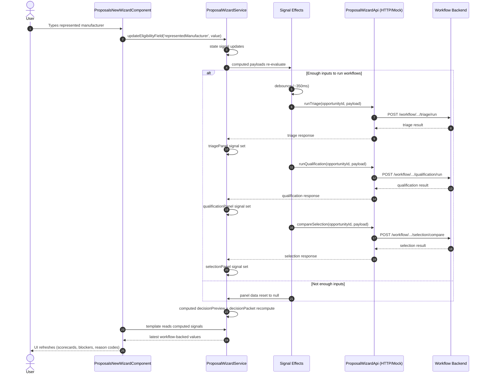

# Angular Wizard Sequence Walkthrough

This companion guide shows one end-to-end user interaction in the Proposal Wizard.

Audience:
- New Angular developers
- Developers who understand TypeScript basics but are new to signals/effects

Goal:
- Understand exactly how a single UI change becomes a backend call and then updates the screen.

## Scenario

User updates the `Represented Manufacturer` field on the New Proposal page.

Relevant files:
- [frontend/hvac/src/app/pages/proposals-new-wizard.component.ts](../frontend/hvac/src/app/pages/proposals-new-wizard.component.ts)
- [frontend/hvac/src/app/pages/proposal-wizard.service.ts](../frontend/hvac/src/app/pages/proposal-wizard.service.ts)
- [frontend/hvac/src/app/pages/proposal-wizard-http-api.service.ts](../frontend/hvac/src/app/pages/proposal-wizard-http-api.service.ts)
- [frontend/hvac/src/app/pages/proposal-wizard-api.ts](../frontend/hvac/src/app/pages/proposal-wizard-api.ts)

## Sequence Diagram

## Step-by-Step Explanation

1. Template event fires
- In the component template, the input uses `ngModelChange`.
- The component calls service methods like `updateEligibilityField(...)`.

2. Service state changes
- `state` is an Angular signal in `ProposalWizardService`.
- Updating one field triggers dependent `computed(...)` values to re-run.

3. Effects decide whether to call backend
- The service has `effect(...)` blocks watching computed payloads.
- If required fields are missing, workflow panels are cleared.
- If required fields exist, the effect debounces and triggers API calls.

4. API implementation is injected at runtime
- `PROPOSAL_WIZARD_API` token resolves to HTTP or mock in `app.config.ts`.
- Same service logic works in both modes.

5. Backend responses update panel signals
- Each response is stored in `triagePanel`, `qualificationPanel`, `selectionPanel`.
- These are also signals, so UI updates automatically.

6. Derived outputs recompute automatically
- `decisionPreview` and `decisionPacket` are `computed(...)`.
- They react to panel results, validation issues, and workflow blockers.

7. Template re-renders
- Component uses `computed(() => service.someSignal())` accessors.
- Angular change detection updates only what depends on changed signals.

## Why This Pattern Is Good

- Single source of truth: state logic is in service, not scattered in template.
- Swappable data sources: mock and real HTTP share one interface.
- Predictable updates: signals/computed/effect make dependency flow explicit.
- Easier testing: service can be unit tested without rendering full component.

## Common Beginner Questions

Q: Why does the UI sometimes show empty workflow panels?
- Because required inputs are not complete yet, so payload builders return `null` and effects reset panels.

Q: Why do calls feel delayed?
- Deliberate debounce (about 350ms) prevents sending a request on every keystroke.

Q: Where do I add a new workflow field?
- Usually in this order:
  1. `proposal-wizard-api.ts` contracts
  2. HTTP and mock API services
  3. `ProposalWizardService` state/payload/computed logic
  4. `proposals-new-wizard.component.ts` template

## Fast Practice Exercise

Try this once:

1. In `proposals-new-wizard.component.ts`, type a different represented manufacturer.
2. In `proposal-wizard.service.ts`, place logs in:
- `updateEligibilityField`
- `buildQualificationRequestPayload`
- `refreshQualification`
3. Observe how one field edit flows to API call and panel refresh.

That single exercise teaches most of this app's Angular architecture.
