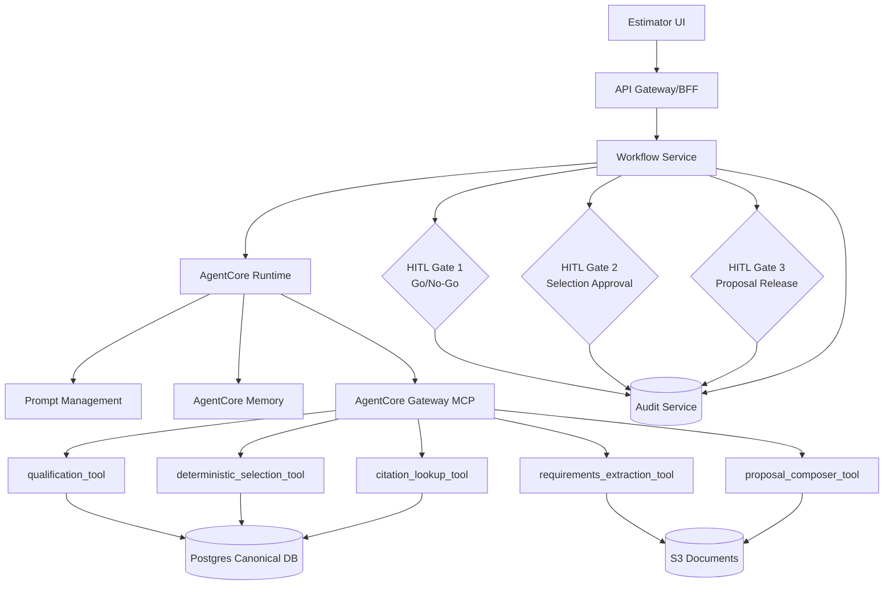

# HVAC Agentic Platform: AWS Architecture Kickoff

## 1. Architecture Goal

Design a production-oriented MVP architecture for Proposal-stage automation with:

- Deterministic A/B/C workflow orchestration
- Human-in-the-loop checkpoints
- Strong tenant isolation and auditability
- Fast path to pilot without overbuilding

Stakeholder narrative reference:

- See `documentation/bid-process-use-case.md` for the business flow this architecture supports from intake through human-approved release.

## 2. System Context Diagram (AWS-Mapped)

User Browser
  |
  v
CloudFront + S3 (Angular SPA)
  |
  v
Amazon Cognito (AuthN/AuthZ)
  |
  v
Amazon API Gateway (HTTP API)
  |
  v
Service Layer (ECS Fargate, private subnets)
  |- Orchestrator Service (A/B/C state machine driver)
  |- Document Service (upload, parse, citation indexing)
  |- Qualification Service (Layer A)
  |- Selection Service (Layer B deterministic rules)
  |- Proposal Service (Layer C output generation)
  |- Audit Service (append-only evidence)
  |
  +--> AWS Step Functions (long-running workflow state)
  +--> Amazon SQS (+ DLQ) for async jobs
  +--> Amazon EventBridge for workflow events
  +--> Amazon Bedrock for extraction/summarization tasks
  +--> Amazon Textract for OCR on scanned bid packages
  +--> Amazon S3 (raw docs, processed artifacts, outputs)
  +--> Amazon RDS for PostgreSQL (canonical schema + pgvector)
  +--> Amazon ElastiCache Redis (job/session/cache)
  +--> AWS KMS (encryption keys)
  +--> AWS Secrets Manager (credentials, API keys)

Observability/Security Plane
  |- Amazon CloudWatch (metrics, logs, alarms)
  |- AWS X-Ray (traces)
  |- AWS CloudTrail (API audit)
  |- AWS WAF + AWS Shield Standard (edge protection)
  |- AWS Config + Security Hub (posture and controls)

## 3. Functional Layer to AWS Service Mapping

### Bedrock Data Automation fit

Bedrock Data Automation is a strong candidate for the document-heavy extraction parts of the platform, especially where structured requirements are buried in unstructured bid artifacts.

Recommended use in this architecture:

- Primary fit: Layer A qualification extraction and Layer B requirement extraction/normalization
- Secondary fit: citation-rich evidence extraction used by Proposal Studio and Audit views
- Not a fit: deterministic model matching and compliance rule decisions in Layer B tool-path logic

### Layer A: Qualification

- Input capture: API Gateway + Document Service on ECS
- Document parsing: Bedrock Data Automation (preferred) or Textract + Bedrock extraction prompts
- Opportunity scoring: Qualification Service + Postgres entities
- HITL decision gate: UI workflow action stored in Postgres and Audit Service

### Layer B: Spec Matching and Model Selection

- Requirement extraction: Bedrock Data Automation or Bedrock prompt pipeline + deterministic normalization in Selection Service
- Tool path evaluation: deterministic rule engine in Selection Service
- Catalog retrieval: S3 source files + pgvector semantic lookup
- Human path entry: Selection Console writes manufacturer outputs via API Gateway
- Comparison artifact: stored in Postgres and written to audit stream

### Layer C: Proposal Generation

- Draft assembly: Proposal Service + tenant template config
- Output files: generated DOCX/PDF to S3
- Final approval gate: reviewer action from UI
- Publish event: EventBridge notification + immutable audit record

## 4. Human-in-the-Loop Control Points (Mandatory)

1. Gate 1: Qualification go/no-go
- Actor: Estimator/Coordinator
- Enforcement: workflow cannot proceed to Layer B without explicit decision

2. Gate 2: Final model selection approval
- Actor: SME/Reviewer
- Enforcement: tool-path vs manufacturer-path comparison must be acknowledged

3. Gate 3: Proposal release approval
- Actor: Manager/Approver
- Enforcement: customer-facing output cannot be published without approval event

## 5. Tenant Isolation Model

- Identity isolation: Cognito groups and tenant claims in JWT
- Data isolation: tenant_id enforced in API layer and database row-level security
- File isolation: S3 prefix per tenant and per project
- Retrieval isolation: vector queries always scoped by tenant filters
- Secrets isolation: per-environment and per-service secrets in Secrets Manager

## 6. Proposed AWS Deployment Topology (MVP)

- Region: us-east-1
- Network: 1 VPC, 2 AZs, private subnets for app/data, public only for edge ingress
- Compute: ECS Fargate services behind internal load balancing where needed
- API ingress: API Gateway with Cognito authorizer
- Database: RDS PostgreSQL Multi-AZ (enable pgvector)
- Storage: S3 buckets for raw input, intermediate artifacts, generated outputs

Recommended S3 buckets:

- hvac-docs-raw
- hvac-docs-processed
- hvac-proposals-output
- hvac-audit-export

## 7. Workflow Orchestration Pattern

- Synchronous user operations via API Gateway to ECS services
- Asynchronous heavy tasks via SQS and Step Functions
- EventBridge used for state transition events and notifications
- All workflow transitions persisted in Postgres + Audit Service

Bedrock Data Automation integration pattern:

- Submit raw bid package and metadata from Document Service
- Receive structured extraction payload with page-level references
- Normalize into canonical entities: Requirement, DocumentBundle, Evidence references
- Route low-confidence or missing-critical-field outputs to manual review queue

Example state progression:

- Uploaded
- Parsed
- Qualified-Pending-Review
- Qualified-Approved
- Selection-Computed
- Selection-Pending-Review
- Selection-Approved
- Proposal-Draft-Ready
- Proposal-Pending-Approval
- Proposal-Published

## 8. Security and Compliance Baseline

- Encryption at rest: S3 SSE-KMS, RDS KMS, Secrets Manager KMS
- Encryption in transit: TLS 1.2+ edge and service communication
- IAM: least-privilege roles per service task
- Immutable evidence: append-only audit records with hash/checksum chain
- Backups: automated RDS backups + S3 versioning + lifecycle retention policy

## 9. CI/CD and Environments

Environments:

- dev
- pilot
- prod

Pipeline approach:

- GitHub Actions builds containers and pushes to ECR
- IaC via Terraform for networking, data stores, and service stacks
- Progressive deployment: dev -> pilot -> prod with approval gates

## 10. Implementation Kickoff Sequence (First 6 Weeks)

Week 1-2

- Stand up core AWS foundation (VPC, ECS, RDS, S3, API Gateway, Cognito)
- Create canonical schema and tenant isolation controls
- Build upload and project creation APIs

Week 3-4

- Integrate Bedrock Data Automation for extraction pipeline (fallback: Textract + Bedrock prompts)
- Implement Layer A Qualification service + HITL Gate 1
- Build initial Angular work queue and qualification console

Week 5-6

- Implement Layer B deterministic rule engine + catalog retrieval
- Add manufacturer-path input workflow + HITL Gate 2
- Emit comparison artifact and audit trails

## 11. Open Decisions for Kickoff Meeting

1. ECS Fargate-only vs mixed Lambda + Fargate for async tasks
2. pgvector in Postgres vs OpenSearch Serverless vector index
3. Single-account multi-tenant vs account-per-tenant roadmap trigger
4. Bedrock model selection for extraction quality and cost envelope
5. Output rendering stack for DOCX/PDF standardization
6. Bedrock Data Automation rollout decision
 - Option A: Use as primary extraction pipeline from day one
 - Option B: Dual-run against existing extraction on pilot documents and cut over after quality threshold is met

## 12. Bedrock Data Automation Pilot Guardrails

Use these guardrails to de-risk adoption:

1. Quality threshold
- Accept cutover only when extraction precision/recall on pilot document set meets agreed threshold for required fields

2. Confidence policy
- Any extraction below confidence threshold or missing mandatory fields is blocked and sent to HITL correction

3. Deterministic boundary
- Never let extraction service choose final model or compliance pass/fail decisions

4. Replay and traceability
- Persist raw extraction outputs, normalized outputs, and user corrections for replay and regression testing

5. Cost controls
- Add per-tenant usage metering and alerting for extraction calls and document volume

## 13. AgentCore and Strands Integration Blueprint

This section defines how to use Strands Agent SDK with Amazon Bedrock AgentCore services without breaking deterministic workflow controls.

### 13.1 Recommended responsibility split

Agentic responsibilities (Strands + AgentCore):

- Unstructured extraction and summarization
- Draft generation support
- Tool selection and invocation planning
- Session-level context assistance

Deterministic platform responsibilities (internal services):

- Numeric/model matching and compliance checks
- Workflow stage transitions and required HITL gates
- Final commercial artifact state changes (approved/published)
- Canonical system of record for decisions and audit evidence

### 13.2 AgentCore service mapping

1. AgentCore Runtime
- Run Layer A and Layer B extraction agents in isolated sessions

2. AgentCore Memory
- Store bounded project/session context and user preferences
- Do not treat Memory as final source of truth for approvals/compliance

3. AgentCore Gateway (MCP)
- Expose internal deterministic services as governed MCP tools
- Enforce tool-level policies and permissions

4. Prompt Management
- Version prompts by workflow layer and promote across environments
- Persist prompt version IDs into audit events

### 13.3 Interaction diagram (proposal stage)

### 13.4 Initial MCP tool catalog (v0.1)

1. qualification_tool
- Input: project metadata + parsed bid package references
- Output: scope candidates, approved manufacturers, confidence metrics

2. requirements_extraction_tool
- Input: document bundle IDs
- Output: normalized requirement objects with citations

3. deterministic_selection_tool
- Input: normalized requirements + catalog references
- Output: tool-path recommended model(s) and rule check results

4. selection_comparison_tool
- Input: tool-path output + human-entered manufacturer software output
- Output: comparison deltas and approval-ready summary

5. proposal_composer_tool
- Input: approved selection + pricing/template metadata
- Output: proposal draft artifact references (DOCX/PDF)

6. citation_lookup_tool
- Input: claim ID or requirement ID
- Output: source pages/spans for explainability UI

### 13.5 Prompt Management strategy

Define prompt families with semantic versioning:

- `layer_a_qualification_extract` (v1.x)
- `layer_b_requirement_normalize` (v1.x)
- `layer_c_proposal_draft` (v1.x)

Promotion path:

- dev -> pilot -> prod

Operational rule:

- Every agent run records prompt family + version in audit events

### 13.6 Memory policy and boundaries

Use Memory for:

- Session context
- User preferences
- Non-authoritative reasoning context

Do not use Memory for:

- Final approvals
- Compliance pass/fail results
- Final pricing decisions
- Published artifact status

Authoritative records remain in canonical DB + audit log.

### 13.7 Rollout plan (low-risk)

Phase 1

- Introduce Strands agent for Layer A only in AgentCore Runtime
- Connect `qualification_tool` and `requirements_extraction_tool` via Gateway

Phase 2

- Add Layer B extraction/normalization with deterministic selection as MCP tool
- Keep selection approval as mandatory HITL gate

Phase 3

- Add Layer C draft assistance and citation lookup via MCP tools
- Keep final proposal release as mandatory HITL gate

### 13.8 Governance controls

1. Policy enforcement
- Use Gateway-integrated policies to control which agent can call which tool

2. Audit completeness
- Persist runtime session IDs, tool calls, prompt versions, and gate decisions

3. Blast-radius control
- Restrict autonomous actions to draft/extraction tasks; no auto-publish privileges
